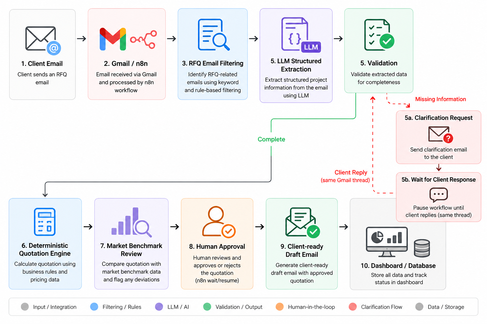
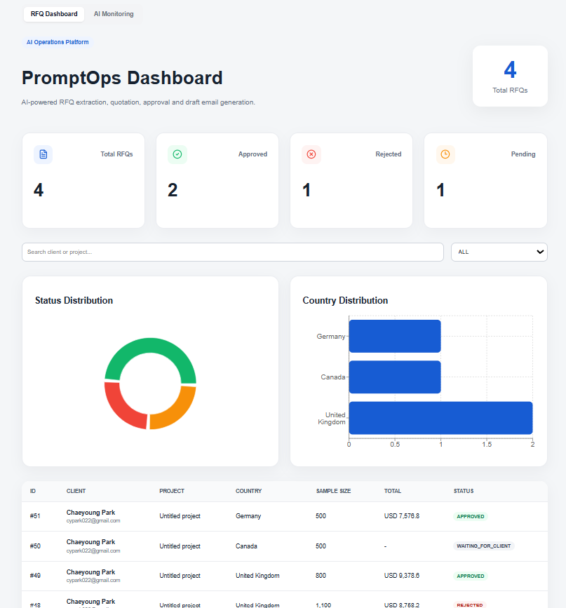
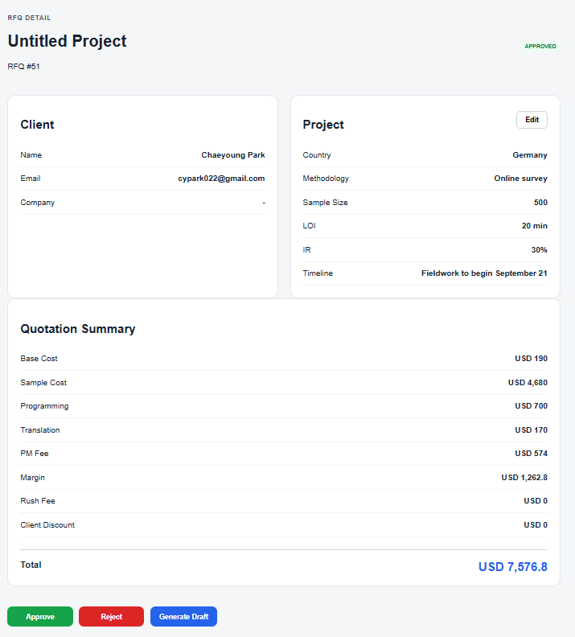
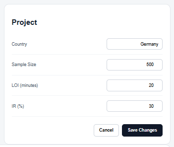
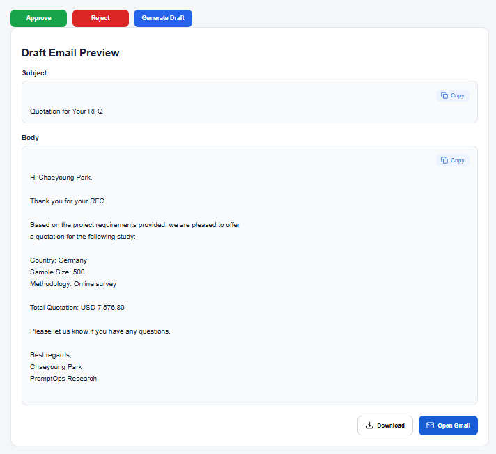
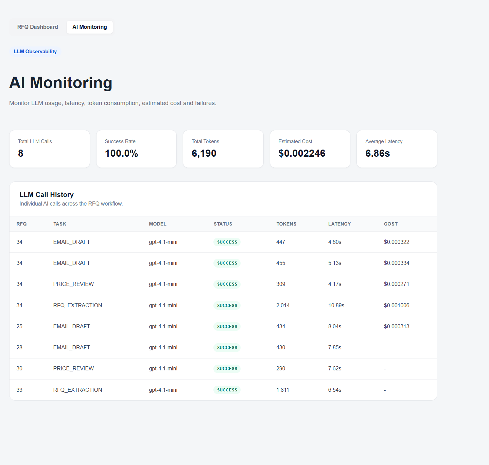
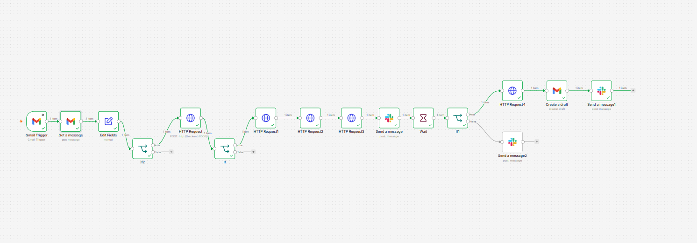

# PromptOps

> **An AI-powered RFQ Automation Platform for Market Research Operations**

PromptOps is an end-to-end RFQ (Request for Quotation) automation system designed to reduce repetitive manual work in market research operations.

It processes incoming client RFQ emails, extracts structured project requirements using an LLM, validates missing information, calculates quotations using deterministic pricing rules, performs an AI-assisted price review, routes the quotation through human approval, and generates a client-ready email draft.

The project focuses on combining **LLM automation with deterministic business logic, human-in-the-loop controls, evaluation, and operational monitoring**.

---

## Problem

RFQ processing in market research operations often requires manually:

- Reading incoming client emails
- Extracting project specifications
- Checking whether required information is missing
- Calculating project costs
- Reviewing whether the quotation looks reasonable
- Getting internal approval
- Preparing a client response

These repetitive steps increase processing time and create opportunities for manual errors.

PromptOps automates this workflow while keeping pricing decisions and final approval under explicit operational control.

---

## Workflow




---

## Architecture

```text
                      Gmail
                        │
                        ▼
                       n8n
                  Workflow Layer
                        │
                        ▼
                 FastAPI Backend
                        │
  ┌─────────────────────┼─────────────────────┐
  │                     │                     │
  ▼                     ▼                     ▼
  OpenAI API          Business Logic          PostgreSQL
  │                     │                / Supabase
  │              ┌──────┴──────┐
  │              │             │
  ▼              ▼             ▼
  RFQ Extraction   Quotation      Market Price
  │            Engine          Review
  │              │             │
  │              │       Market Benchmark
  │              │             Data
  │              │
  └──────────────┼─────────────────────┐
                 │                     │
                 ▼                     ▼
         Next.js Dashboard      Email Generation
                 │
                 ▼
           Human Approval
```


### Design Principle

PromptOps deliberately separates **probabilistic AI tasks** from **deterministic business logic**.

LLMs are used for tasks such as:

- Understanding unstructured RFQ emails
- Reviewing generated prices
- Drafting client communication

Deterministic Python logic is used for:

- Pricing calculations
- Cost multipliers
- Fees and margins
- Currency conversion
- Workflow validation

Final quotation decisions remain behind a **human approval step**.

---

## Key Features

### AI-powered RFQ Extraction

Incoming RFQ emails are converted into structured data using the OpenAI API with structured outputs.

Extracted fields include:

- Country / Countries
- Sample Size
- Target Audience
- LOI
- Incidence Rate
- Methodology
- Timeline
- Programming Requirements
- Translation Requirements
- Languages
- Rush Requirements
- Client Information
- Currency

---

### RFQ Validation

Required project information is validated before quotation generation.

Incomplete RFQs can be identified before entering the pricing workflow, preventing quotations from being generated from insufficient project information.

---

### Deterministic Quotation Engine

Quotation calculation is handled through Python business rules rather than an LLM.

Pricing components include:

- Country base cost
- Panel CPI
- Sample size
- LOI multiplier
- IR multiplier
- Programming fee
- Translation fee
- Project management fee
- Rush fee
- Margin
- Client discount
- Currency conversion
- Multi-country pricing

This keeps financial calculations predictable and auditable.

---

### AI-assisted Price Review

After the quotation engine generates a price, an LLM performs an additional review and returns:

- Recommendation
- Confidence
- Review summary

The LLM does **not** directly determine the final quotation.

---

### Human-in-the-loop Approval

Quotation decisions require explicit human review.

Users can:

- Review RFQ information
- Inspect the calculated quotation
- Approve or reject the quotation
- Add reviewer comments

This prevents fully autonomous client-facing pricing decisions.

---

### RFQ Editing & Recalculation

Extracted RFQ values can be corrected from the dashboard.

When pricing-related fields are modified, the quotation can be recalculated using the updated RFQ data.

This allows human operators to correct extraction errors or client requirement changes without restarting the entire workflow.

---

### Client-ready Email Generation

Approved quotations can be converted into professional client-facing email drafts using the LLM.

The generated draft incorporates:

- Client information
- Project requirements
- Final quotation
- Sender information

---

## LLM Evaluation

PromptOps includes a Golden Set-based evaluation workflow for RFQ extraction.

```text
Golden Set
    │
    ▼
RFQ Extractor
    │
    ▼
Predicted Structured Output
    │
    ▼
Expected vs Actual Comparison
    │
    ▼
Evaluation Metrics
```

The evaluation layer makes extraction quality measurable rather than relying only on manual prompt testing.

This also supports identifying extraction failure cases and improving prompts systematically.

---

## LLM Monitoring

LLM calls are logged for operational monitoring.

Tracked information includes:

- Task type
- Model
- Success / failure
- Input tokens
- Output tokens
- Latency
- Estimated API cost
- Error information

A monitoring dashboard provides aggregated metrics such as:

- Total LLM calls
- Success rate
- Token usage
- Average latency
- Estimated cost

This provides visibility into both **LLM quality and operational cost**.

---

## Dashboard

The Next.js dashboard provides an operational interface for managing RFQs.

It supports:

- RFQ overview
- Search and status filtering
- RFQ status visualization
- RFQ detail inspection
- Quotation breakdown
- RFQ editing
- Human approval / rejection
- Draft email preview
- LLM monitoring

---

## Tech Stack

| Category | Technologies |
|---|---|
| Frontend | Next.js, TypeScript |
| Backend | FastAPI, Python |
| AI | OpenAI API, Structured Outputs |
| Database | PostgreSQL, Supabase |
| ORM / Migration | SQLAlchemy, Alembic |
| Workflow Automation | n8n |
| Email Integration | Gmail |
| Infrastructure | Docker Compose |
| Backend Deployment | Railway |
| Frontend Deployment | Vercel |
| Evaluation | Golden Set-based extraction evaluation |

---

## Project Structure

```text
backend/
├── app/
│   ├── api/
│   ├── config/
│   ├── db/
│   │   ├── mappers/
│   │   ├── models/
│   │   └── repositories/
│   ├── models/
│   ├── prompts/
│   ├── services/
│   └── utils/
│
└── evaluation/
    ├── evaluate_extraction.py
    └── golden_set.json

frontend/
├── app/
├── components/
├── services/
└── types/

n8n
└── Workflow orchestration
```

The backend follows a layered structure separating:

```text
API
 ↓
Service
 ↓
Repository
 ↓
Database
```

Business logic such as quotation calculation remains in the service layer, while database access is isolated through repositories.

---

## Screenshots

### RFQ Dashboard



### RFQ Detail & Quotation



### RFQ Editing & Recalculation



### Draft Email Generation



### LLM Monitoring



### Workflow Orchestration



---

## Running Locally

### 1. Clone the repository

```bash
git clone <repository-url>
cd rfq
```

### 2. Configure environment variables

Create the required environment configuration for the backend.

Required services include:

- OpenAI API
- PostgreSQL database
- Gmail / n8n configuration where applicable

Do not commit secrets or local runtime data to the repository.

### 3. Start the application

```bash
docker compose up --build
```

### 4. Access the services

Frontend:

```text
http://localhost:3000
```

FastAPI documentation:

```text
http://localhost:8000/docs
```

n8n:

```text
http://localhost:5678
```

---

## Engineering Decisions

### Why not use an LLM for quotation calculation?

Pricing is financial business logic that needs to be deterministic and reproducible.

The LLM extracts unstructured information and provides an additional review, but the actual quotation is calculated using explicit Python rules.

### Why Human Approval?

Even when extraction and pricing are automated, sending a quotation directly to a client introduces operational and financial risk.

PromptOps therefore keeps the final decision behind a human approval gate.

### Why add evaluation?

A successful API response does not mean an extraction is correct.

The Golden Set evaluation layer provides a repeatable way to measure extraction behavior and identify regressions when prompts or models change.

### Why monitor tokens, latency, and cost?

LLM workflows need operational observability just like traditional software systems.

Tracking these metrics makes model usage, performance, failures, and cost visible rather than treating the LLM as a black box.

---

## Status

**Core workflow complete.**

The system currently supports the complete RFQ lifecycle from incoming email processing through quotation generation, AI review, human approval, draft generation, database persistence, evaluation, and LLM monitoring.
