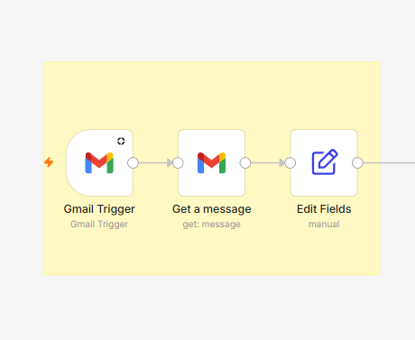
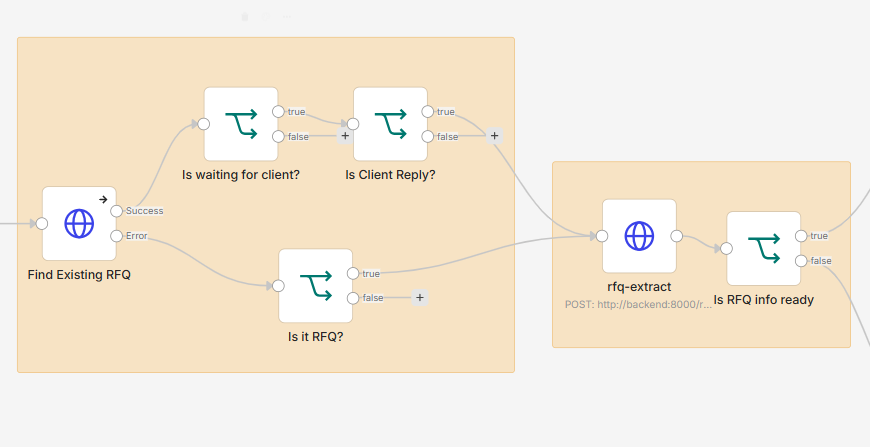
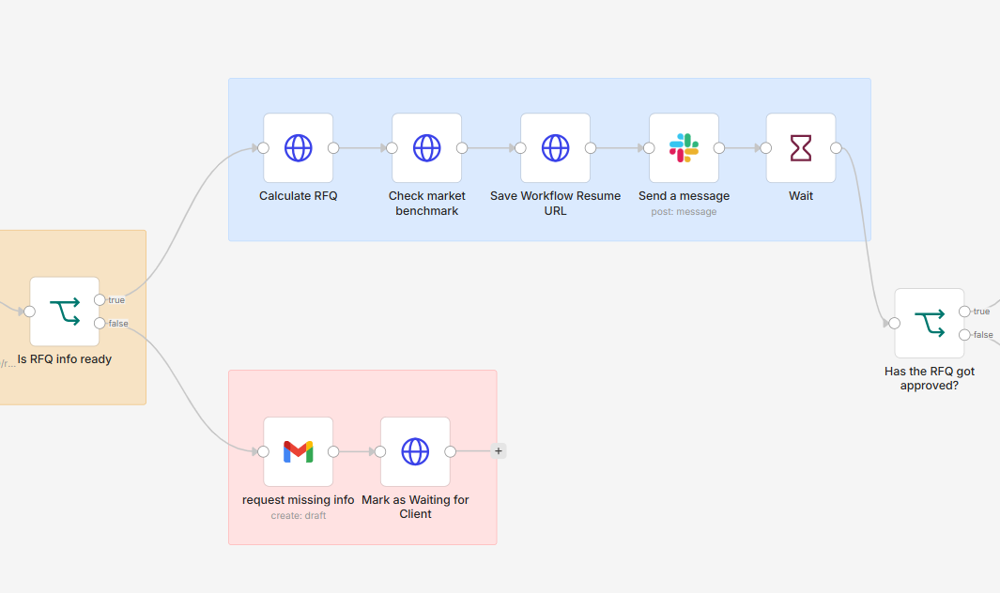
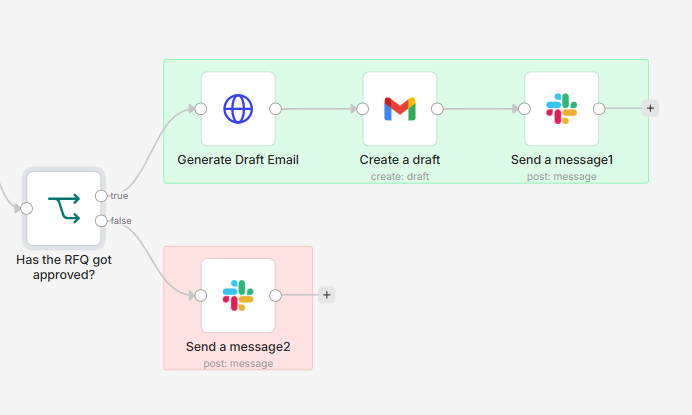

# RFQ Automation

> **An AI-powered RFQ Automation Platform for Market Research Operations**

RFQ Automation is an end-to-end RFQ (Request for Quotation) automation system designed to reduce repetitive manual work in market research operations.

It processes incoming client RFQ emails, extracts structured project requirements using an LLM, validates required information, calculates quotations using deterministic pricing rules, compares generated prices against market benchmark data, routes quotations through human approval, and generates client-ready email drafts.

The project focuses on combining **LLM-assisted automation with deterministic business logic, human-in-the-loop controls, evaluation, and operational monitoring**.

---

## Problem

RFQ processing in market research operations often requires manually:

* Reading incoming client emails
* Extracting project specifications
* Checking whether required information is missing
* Calculating project costs
* Reviewing whether the quotation looks reasonable
* Getting internal approval
* Preparing a client response

These repetitive steps increase processing time and create opportunities for manual errors.

RFQ Automation automates this workflow while keeping pricing calculations and final approval under explicit operational control.

---

## Workflow


---

## Architecture
                         Gmail
                           │
                           ▼
                          n8n
                  Workflow Orchestration
                           │
                           ▼
                    FastAPI Backend
                           │
        ┌──────────────────┼──────────────────┐
        │                  │                  │
        ▼                  ▼                  ▼
   OpenAI API        Business Logic      PostgreSQL
        │                  │             / Supabase
        │           ┌──────┴──────┐
        │           │             │
        ▼           ▼             ▼
 RFQ Extraction  Quotation    Market Price
                   Engine        Review
                     │             │
                     │             ▼
                     │       Market Benchmark
                     │             Data
                     │
                     └─────────────┐
                                   │
                                   ▼
                           Next.js Dashboard
                                   │
                                   ▼
                            Human Approval
                                   │
                                   ▼
                           Workflow Resume
                                   │
                                   ▼
                           Email Generation
                                   │
                                   ▼
                              Gmail Draft
```


### Design Principle

RFQ Automation deliberately separates **probabilistic AI tasks** from **deterministic business logic**.

LLMs are used for tasks such as:

* Understanding unstructured RFQ emails
* Converting email content into structured RFQ data
* Drafting client communication

Deterministic Python logic is used for:

* RFQ validation
* Pricing calculations
* Cost multipliers
* Fees and margins
* Currency conversion
* Market benchmark comparison
* Workflow state handling

Final quotation decisions remain behind a **human approval step**.

---

## Key Features

### AI-powered RFQ Extraction

Incoming RFQ emails are converted into structured data using the OpenAI API with structured outputs.

Extracted fields include:

* Country / Countries
* Sample Size
* Target Audience
* LOI
* Incidence Rate
* Methodology
* Timeline
* Programming Requirements
* Translation Requirements
* Languages
* Rush Requirements
* Client Information
* Currency

The system supports RFQ information arriving across multiple emails in the same Gmail thread. New information can be merged into the existing RFQ record using the Gmail thread identifier rather than creating a separate RFQ.

---

### RFQ Validation & Clarification

Required project information is validated before quotation generation.

When required information is missing, the RFQ can be marked as waiting for client information and clarification questions can be generated before the workflow continues.

Client replies within the same Gmail thread can be processed and merged into the existing RFQ, allowing incomplete RFQs to be progressively completed.

---

### Deterministic Quotation Engine

Quotation calculation is handled through explicit Python business rules rather than an LLM.

Pricing components include:

* Country base cost
* Panel CPI
* Sample size
* LOI multiplier
* IR multiplier
* Programming fee
* Translation fee
* Project management fee
* Rush fee
* Margin
* Client discount
* Currency conversion
* Multi-country pricing

This keeps financial calculations predictable, reproducible, and auditable.

When optional pricing inputs such as LOI or IR are unavailable, the quotation engine can apply defined fallback behavior rather than failing the workflow. These values can later be reviewed and corrected by an operator.

---

### Market Benchmark Price Review

After the quotation engine generates a price, the calculated quotation is compared against stored market benchmark data.

Benchmark matching considers project attributes such as:

* Country
* Sample size
* LOI
* Incidence rate
* Programming requirements
* Translation requirements
* Rush requirements

The review can classify a quotation as:

* `BELOW_BENCHMARK`
* `WITHIN_BENCHMARK`
* `ABOVE_BENCHMARK`
* `NO_BENCHMARK`

When sufficient information is not available to select an appropriate benchmark, the system returns `NO_BENCHMARK` instead of forcing an arbitrary comparison.

The benchmark review does **not** determine or modify the quotation itself. Final pricing decisions remain under human control.

---

### Human-in-the-loop Approval

Quotation decisions require explicit human review.

Users can:

* Review RFQ information
* Inspect the calculated quotation
* Review market benchmark results
* Approve or reject the quotation
* Add reviewer comments

The workflow can pause while waiting for human approval and resume after a decision is submitted.

This prevents fully autonomous client-facing pricing decisions.

---

### RFQ Editing & Recalculation

Extracted RFQ values can be corrected from the dashboard.

When pricing-related fields such as LOI or IR are modified, the updated RFQ is passed back through the deterministic quotation engine and the quotation is recalculated.

This allows human operators to correct extraction results, add internally determined values, or reflect changes in client requirements without restarting the RFQ from the beginning.

---

### Client-ready Email Generation

Approved quotations can be converted into professional client-facing email drafts.

The generated draft incorporates information such as:

* Client information
* Project requirements
* Final quotation
* Sender information

The workflow creates a Gmail draft rather than automatically sending the quotation, preserving human control over client-facing communication.

---

## LLM Evaluation

RFQ Automation includes a Golden Set-based evaluation workflow for RFQ extraction.

```text
Golden Set
    │
    ▼
RFQ Extractor
    │
    ▼
Predicted Structured Output
    │
    ▼
Expected vs Actual Comparison
    │
    ▼
Evaluation Metrics
```

The evaluation layer makes extraction quality measurable rather than relying only on manual prompt testing.

This supports identifying extraction failure cases and detecting regressions when extraction prompts or models change.

---

## LLM Monitoring

LLM calls are logged for operational monitoring.

Tracked information includes:

* Task type
* Model
* Success / failure
* Input tokens
* Output tokens
* Latency
* Estimated API cost
* Error information

A monitoring dashboard provides aggregated metrics such as:

* Total LLM calls
* Success rate
* Token usage
* Average latency
* Estimated cost

This provides visibility into both **LLM behavior and operational cost**.

---

## Dashboard

The Next.js dashboard provides an operational interface for managing RFQs.

It supports:

* RFQ overview
* Search and status filtering
* RFQ status visualization
* RFQ detail inspection
* Quotation breakdown
* Market benchmark review results
* RFQ editing
* Quotation recalculation
* Human approval / rejection
* Draft email preview
* LLM monitoring

---

## Tech Stack

| Category            | Technologies                           |
| ------------------- | -------------------------------------- |
| Frontend            | Next.js, TypeScript                    |
| Backend             | FastAPI, Python                        |
| AI                  | OpenAI API, Structured Outputs         |
| Database            | PostgreSQL, Supabase                   |
| ORM / Migration     | SQLAlchemy, Alembic                    |
| Workflow Automation | n8n                                    |
| Email Integration   | Gmail                                  |
| Infrastructure      | Docker Compose                         |
| Backend Deployment  | Railway                                |
| Frontend Deployment | Vercel                                 |
| Evaluation          | Golden Set-based extraction evaluation |

---

## Project Structure

```text
backend/
├── app/
│   ├── api/
│   ├── config/
│   ├── db/
│   │   ├── mappers/
│   │   ├── models/
│   │   └── repositories/
│   ├── models/
│   ├── prompts/
│   ├── services/
│   └── utils/
│
└── evaluation/
    ├── evaluate_extraction.py
    └── golden_set.json

frontend/
├── app/
├── components/
├── services/
└── types/

n8n
└── Workflow orchestration
```

The backend follows a layered structure separating:

```text
API
 ↓
Service
 ↓
Repository
 ↓
Database
```

Business logic such as quotation calculation and market benchmark comparison remains in the service layer, while database access is isolated through repositories.

---

## Screenshots

### RFQ Dashboard


### RFQ Detail & Quotation


### RFQ Editing & Recalculation


### Draft Email Generation


### LLM Monitoring


### Workflow Orchestration







---

## Running Locally

### 1. Clone the repository

```bash
git clone <repository-url>
cd rfq
```

### 2. Configure environment variables

Create the required environment configuration for the backend.

Required services include:

* OpenAI API
* PostgreSQL database
* Gmail / n8n configuration where applicable

Do not commit secrets or local runtime data to the repository.

### 3. Start the application

```bash
docker compose up --build
```

### 4. Access the services

Frontend:

```text
http://localhost:3000
```

FastAPI documentation:

```text
http://localhost:8000/docs
```

n8n:

```text
http://localhost:5678
```

---

## Engineering Decisions

### Why not use an LLM for quotation calculation?

Pricing is financial business logic that needs to be deterministic and reproducible.

The LLM extracts unstructured information, while the actual quotation is calculated using explicit Python rules.

This separation prevents probabilistic model behavior from directly determining financial calculations.

### Why use deterministic market benchmark comparison?

A generated quotation should be reviewable against known pricing ranges without allowing an LLM to independently alter financial decisions.

RFQ Automation therefore compares calculated quotations against structured market benchmark data using deterministic matching rules.

If the available RFQ information is insufficient for an appropriate benchmark comparison, the system returns `NO_BENCHMARK` rather than selecting an arbitrary benchmark.

### Why Human Approval?

Even when extraction and pricing are automated, sending a quotation directly to a client introduces operational and financial risk.

RFQ Automation therefore keeps the final decision behind a human approval gate and generates a Gmail draft rather than automatically sending the client response.

### Why add evaluation?

A successful API response does not mean an extraction is correct.

The Golden Set evaluation layer provides a repeatable way to measure extraction behavior and identify regressions when prompts or models change.

### Why monitor tokens, latency, and cost?

LLM workflows need operational observability just like traditional software systems.

Tracking these metrics makes model usage, performance, failures, and cost visible rather than treating the LLM as a black box.

---

## Status

**Core workflow complete.**


The system currently supports the RFQ lifecycle from incoming email processing and structured extraction through validation, deterministic quotation generation, market benchmark review, human approval, client-ready draft generation, database persistence, extraction evaluation, and LLM monitoring.

